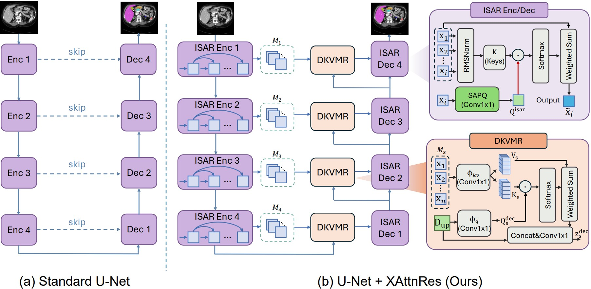

# XAttnRes: Block-Level Attention Residual Routing for Medical Image Segmentation

Official implementation of **"XAttnRes: Cross-Attention Residuals for Block-Level Feature Routing in Medical Image Segmentation"**, submitted to *Medical Image Analysis*.

## Overview

<p align="center">
  
</p>

Existing encoder–decoder segmentation networks route information at the **stage level**: each stage exposes only its final block output while discarding intermediate block histories. XAttnRes refines this routing granularity to the **block level** through three complementary modules:

- **ISAR** (Intra-Stage Attention Residuals) — exposes intermediate block outputs as a same-resolution memory bank and lets each subsequent block selectively reuse them via learned attention.
- **SAPQ** (Spatial Adaptive Pseudo-Query) — generates per-pixel query fields so that different spatial positions (e.g., boundaries vs. interiors) can attend to different block histories.
- **DKVMR** (Decoupled Key-Value Memory Routing) — replaces conventional skip connections with decoder-conditioned attention retrieval over the encoder's complete block memory bank.

XAttnRes is **plug-and-play** and **backbone-agnostic**, applicable to both U-Net and nnU-Net v2 with negligible parameter overhead.

## Code Release

This repository currently provides the **U-Net backbone** implementation of XAttnRes, including training and evaluation scripts for the AMOS22 benchmark.

> **Note:** The nnU-Net v2 integration will be released upon paper acceptance.

## Repository Structure

```
├── XAttnResUnet.py    # XAttnRes model (ISAR + SAPQ + DKVMR on U-Net)
├── train.py           # 2D training script (DDP supported)
├── eval.py            # 3D volume evaluation (slice-wise inference + NIfTI export)
├── dataloader.py      # AMOS 2D PNG dataset & augmentations
├── requirements.txt   # Python dependencies
└── README.md
```

## Requirements

```bash
pip install -r requirements.txt
```

Key dependencies:
- Python ≥ 3.9
- PyTorch ≥ 2.0
- MONAI ≥ 1.3
- Albumentations ≥ 1.3
- SimpleITK ≥ 2.3

## Data Preparation

1. Download the [AMOS22 dataset](https://amos22.grand-challenge.org/).
2. Run preprocessing to convert 3D NIfTI volumes into 2D PNG slices:
   ```bash
   python preprocess.py --dataset_dir /path/to/Dataset101_amos
   ```
3. Generate cross-validation splits using nnU-Net's `splits_final.json` format.

## Training

Single-GPU:
```bash
python train.py \
    --dataset_dir /path/to/Dataset101_amos \
    --preproc_dir /path/to/Dataset101_amos/preprocessed_2d \
    --splits_json /path/to/splits_final.json \
    --fold 0 \
    --num_classes 16 \
    --epoch 500 \
    --batch 32 \
    --lr 1e-4
```

Multi-GPU (DDP):
```bash
torchrun --nproc_per_node=4 train.py \
    --dataset_dir /path/to/Dataset101_amos \
    --preproc_dir /path/to/Dataset101_amos/preprocessed_2d \
    --splits_json /path/to/splits_final.json \
    --fold 0 \
    --num_classes 16 \
    --epoch 500 \
    --batch 32 \
    --lr 1e-4
```

## Evaluation

```bash
python eval.py \
    --dataset_dir /path/to/Dataset101_amos \
    --ckpt_dir outputs/checkpoints \
    --model_tag xattnres \
    --folds 0,1,2,3,4 \
    --gpu 0
```

This runs slice-wise inference on the test volumes, reconstructs 3D predictions, and computes per-organ Dice, IoU, HD95, and ASD with cross-fold summarization.

## Acknowledgements
This work builds upon [nnU-Net](https://github.com/MIC-DKFZ/nnUNet) and [MONAI](https://monai.io/). We thank the AMOS22 challenge organizers for providing the benchmark dataset.
